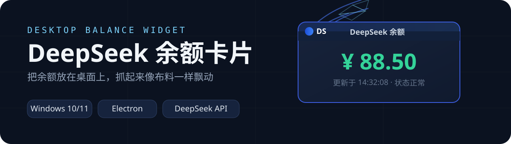
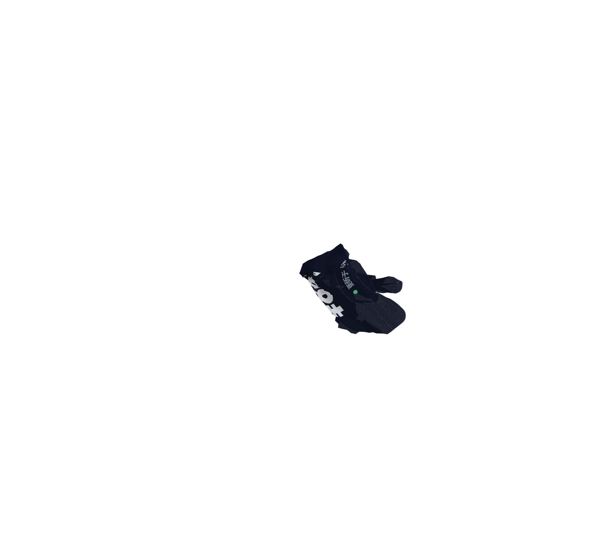
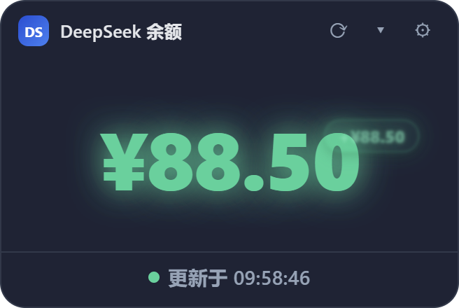
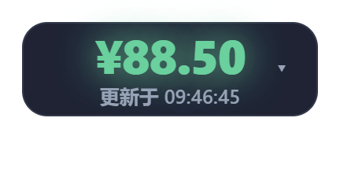

<p align="center">
  
</p>

<div align="center">

DeepSeek API 余额桌面小卡片 —— 半透明、可拖动、始终置顶，还能折叠成迷你卡或圆点。

[]()
[]()
[]()
[]()

</div>

## 先看效果

抓取卡片时，卡片快照会贴到一块 Verlet 布料上，被风鼓起真实的褶皱。拖动方向与速度会通过惯性影响飘动，松手后布料带着惯性甩动、弹回摊平，最后变回卡片。

<p align="center">
  
</p>

| 完整卡片 | 迷你卡 | 圆点 |
| --- | --- | --- |
|  |  |  |

## 为什么不一样

- **布料物理抓取**：Verlet 质点-弹簧网格 + 阵风 + 法线光照。以抓取点为唯一固定点，离手越远的布料越滞后，抓取位置不同动效就不同；拖动越快飘得越猛，松手后平滑回弹摊平，视觉上"布料变成卡片"，不割裂。
- **三种形态**：完整卡片 → 迷你卡 → 圆点，通过右上角下拉菜单或右键菜单随时切换。
- **余额变动动效**：每次刷新余额变化时，数字高亮闪烁，并在余额旁弹出 `-¥1.00` / `+¥0.50` 浮动标签。
- **低余额提醒**：低于阈值时卡片变红并发送一次系统通知。
- **动效参数可调**：风力大小、褶皱幅度、重力、空气阻力、惯性等 12 项滑块参数都能在设置里实时调节，随时一键"恢复默认"。
- **隐私友好**：API Key 只存本机 `%APPDATA%`，不写日志、不进仓库。

## 快速开始

环境要求：Windows 10/11，Node.js 18+。

**方式一（推荐）：双击 `start.bat`** —— 首次运行自动安装依赖，之后每次直接以卡片形态出现在桌面，驻留系统托盘。

**方式二：命令行**

```bash
npm install
npm start
```

**首次使用**

1. 点卡片右上角 ⚙ 打开设置；
2. 填入 DeepSeek API Key（在 [DeepSeek 开放平台](https://platform.deepseek.com/api_keys) 的 "API Keys" 页面创建）；
3. 点"测试连接"确认 Key 有效，再点"保存"，卡片随即显示余额并开始定时刷新。

## 设置

### 动效参数

| 参数 | 说明 | 默认 |
| --- | --- | --- |
| 风效 | 开关 + 大小（0–2） | 开 / 1.0 |
| 褶皱折痕阴影 | z 落差明暗阴影 | 关 |
| 褶皱幅度 / 重力 / 空气阻力 / 回弹阻尼 / 拖拽滞后 / 惯性 / 褶皱深度上限 | 布料手感 | 已打磨的默认值 |
| 捏起收拢 / 捏起隆起 / 抓点隆起 | 抓取点 3D 效果 | 已打磨的默认值 |
| 网格密度 | 布料细腻度（越高越吃 CPU） | 36 |

### 配置文件

配置保存在 `%APPDATA%\deepseek-balance-card\config.json`。

| 字段 | 说明 | 默认 |
| --- | --- | --- |
| `apiKey` | DeepSeek API Key | 空 |
| `refreshInterval` | 刷新间隔（毫秒，最小 10000） | 300000 |
| `lowBalanceThreshold` | 低余额提醒阈值（¥） | 10 |
| `theme` | `dark` / `light` | `dark` |
| `alwaysOnTop` | 窗口置顶 | `true` |
| `autoLaunch` | 开机自启 | `false` |
| `mode` | `card` / `mini` / `dot` | `card` |
| `clothWind` 等 | 布料动效参数 | 见上表 |

## 开发与测试

- `scripts/mock-server.js`：本地 mock 余额接口，配合环境变量 `DS_BALANCE_API` 可脱离官方接口调试；
- `scripts/smoke.ps1`：自动化冒烟测试，输出渲染层 DOM 快照（自动备份/恢复配置）；
- `scripts/visual-check.ps1`：启动应用并截图采样，验证卡片渲染与窗口位置；
- `renderer/cloth.js`：Verlet 布料引擎（结构/剪切/弯曲约束、阵风、法线光照、拖拽惯性耦合），`window.ClothFX` 暴露 `start/stop/setDrag/setParams/debug`。

## 安全说明

- 所有网络请求只发往 `api.deepseek.com`（或本地测试地址）；
- API Key 仅保存在本机 `%APPDATA%` 配置中，不写日志、不提交仓库；
- 本项目非 DeepSeek 官方产品，仅供学习与日常使用。

## License

MIT
